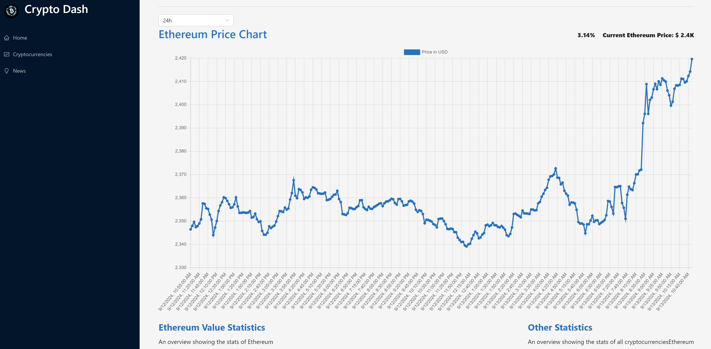

# Crypto Dash

## Author

Cornel Stoica
Full-stack developer

## About

Undergraduate Student at OIT

## Overview

Crypto Dash is a powerful crypto tool that gets real, live crypto data and news used to help users make more informed decisions.

## Installation

To clone the project and view its source code:

1. Clone the repository:

    ```bash
    git clone https://github.com/yourusername/CryptoDash.git
    cd crypto-dash
    ```

2. Install Dependencies:

    ```bash
    npm install
    ```

3. Run/build:

    ```bash
    npm run dev
    ```

## Requirements

This app uses the CoinRanking API endpoint CoinRanking for crypto stats and news. Visit rapidapi.com to get your free keys and place those in a created .env file in root directory.

## Contributing

If you'd like to contribute to this project, please fork the repository and submit a pull request. Any contributions are welcome!
License
This project is licensed under the MIT License - see the LICENSE file for details.

## Future Improvements

Add more functionality.
